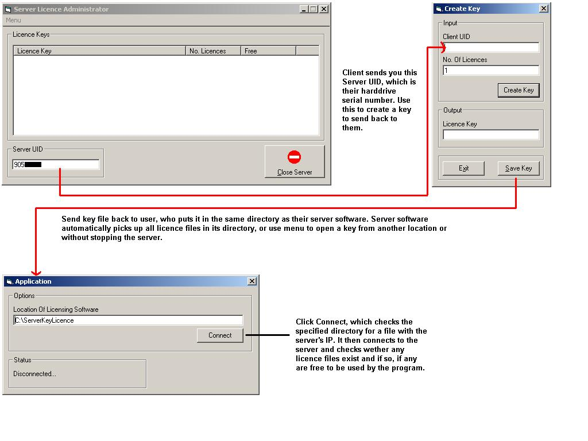



## Server Key Licence

### Description

Allow multiple users to use your app which is *licenced* from one server. Here's the deal: User wants to use 10 copies of your app. So rather than send them 10 individual keys, they get a copy of your server software to install on a server that all users can access. Now the user sends you their server UID (generated byt he program, is actually the users HDD Serial No.). You now create a key file for them for 10 users and send it back to them. They now copy this file in to their servers install directory and get 10 licences. 10 users can now connect and use your end application (any 10 with your application installed, but only 10 at a time. ie, installed on 20 machines, but only 10 at a time can use it!). Your users *cannot* use the same key file twice (to get double the amount of licences) as the key file uses a randomly generated number converted in to hex (encoded inside the actual file) to check that the same file with a different name is not trying to be used. Also, the user cannot run two copies of the server software on the same machine, as the software will only allow itself to be run as long as another application with the same name is not running.The key itself is encoded using the RC4 algorithm, then hidden inside a random generated string which is saved as the key file. RC4 encryption code from PSC, Server Control by Drew Lederman.
 
### More Info
 

             |
---                |---
**Submitted On**   |2001-11-19 13:49:04
**By**             |[Wamdue Project](https://github.com/Planet-Source-Code/PSCIndex/blob/master/ByAuthor/wamdue-project.md)
**Level**          |Intermediate
**User Rating**    |4.8 (82 globes from 17 users)
**Compatibility**  |VB 6\.0
**Category**       |[Miscellaneous](https://github.com/Planet-Source-Code/PSCIndex/blob/master/ByCategory/miscellaneous__1-1.md)
**World**          |[Visual Basic](https://github.com/Planet-Source-Code/PSCIndex/blob/master/ByWorld/visual-basic.md)
**Archive File**   |[Server\_Key3610311192001\.zip](https://github.com/Planet-Source-Code/wamdue-project-server-key-licence__1-29010/archive/master.zip)

